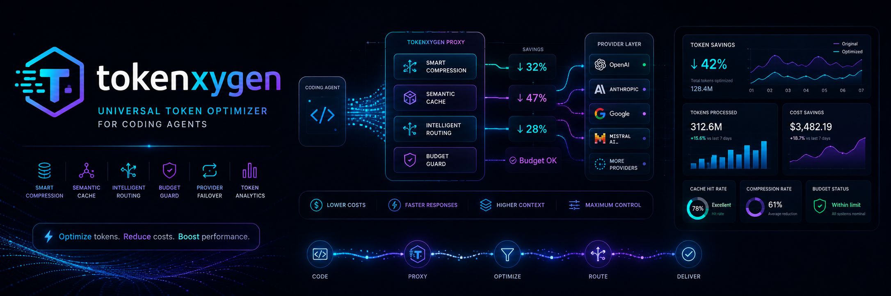

<div align="center">
  
</div>

<h1 align="center">🚀 Tokenxygen</h1>

<p align="center">
  <a href="https://pypi.org/project/tokenxygen/"></a>
  <a href="https://pypi.org/project/tokenxygen/"></a>
  
  
  
</p>

<p align="center"><strong>Universal token optimizer for coding agents — save 40-70% on LLM costs.</strong></p>

<p align="center">Tokenxygen is a drop-in proxy that sits between your coding agent (Claude Code, Cursor, Windsurf, Codex) and LLM APIs, automatically optimizing tokens in-flight. Zero code changes required.</p>

```
┌─────────────┐     ┌────────────────┐     ┌──────────┐
│  Coding      │────▶│  Tokenxygen    │────▶│  OpenAI  │
│  Agent       │◀────│  Proxy         │◀────│  API     │
└─────────────┘     └────────────────┘     └──────────┘
                    🎯 Cache | Compress | Route | Budget
```

## ⚡ Quick Start

```bash
pip install tokenxygen

# Start the proxy
tokenxygen serve

# In another terminal — use your coding agent normally
export OPENAI_BASE_URL=http://127.0.0.1:8420/v1
claude  # or cursor, windsurf, etc.
```

That's it. Tokens are optimized automatically.

## 🔧 How It Works

Tokenxygen applies multiple optimization strategies in order:

| # | Strategy | What It Does | Typical Savings |
|---|----------|-------------|-----------------|
| 1 | **Semantic Cache** | Reuse identical/similar responses | 30-60% |
| 2 | **File Deduplication** | Remove repeated file contents | 10-30% |
| 3 | **Plugin Strategies** | Custom compression (diffs, imports, tool outputs) | 5-20% |
| 4 | **LLMLingua-2** | Token-level compression (when installed) | 40-60% |
| 5 | **Smart Routing** | Send simple queries to cheap models | 40-70% |
| 6 | **Budget Guards** | Enforce daily limits, auto-downgrade | Variable |
| 7 | **Failover** | Automatic provider switching on failure | Availability |

Combined, these typically save **40-70%** on token costs without noticeable quality loss.

## 📊 Dashboard

Start the proxy with a real-time web dashboard:

```bash
tokenxygen serve --dashboard-port 8421
# Open http://127.0.0.1:8421
```

## 🐳 Docker Deployment

```bash
# Quick start with Docker Compose
cp .env.example .env
# Edit .env with your API keys
docker compose up -d

# Services:
# - Proxy: http://localhost:8420
# - Dashboard: http://localhost:8421
# - Prometheus: http://localhost:9091
```

## 🛡️ Security Features

Tokenxygen includes comprehensive security hardening:

| Feature | Description |
|---------|-------------|
| **SSRF Prevention** | Blocks requests to localhost, private IPs, and non-HTTP protocols |
| **Rate Limiting** | Per-IP sliding window with Redis support for distributed deployments |
| **Security Headers** | CSP, HSTS, X-Content-Type-Options, X-Frame-Options, and more |
| **Admin Authentication** | API key protection for sensitive endpoints |
| **Request Validation** | Path traversal and null byte injection prevention |
| **Size Limits** | 10MB maximum request body |
| **Secure Logging** | Authorization headers never logged; correlation IDs for audit trails |

### Environment Variables

```bash
# Security settings
export TOKENXYGEN_ADMIN_KEY="your-admin-api-key"  # Protect admin endpoints
export TOKENXYGEN_REDIS_URL="redis://localhost:6379/0"  # Distributed rate limiting

# Production settings
export OPENAI_BASE_URL="http://localhost:8420/v1"
export OPENAI_API_KEY="sk-..."
```

## 📦 Installation

```bash
# Basic install
pip install tokenxygen

# With LLMLingua-2 for deeper compression
pip install tokenxygen[llmlingua]

# Full install (all features)
pip install tokenxygen[full]

# Development
pip install -e ".[dev]"
```

## 🛠️ CLI Commands

```bash
# Start the proxy server + dashboard
tokenxygen serve
tokenxygen serve --json-logs --log-level DEBUG

# View token usage stats
tokenxygen stats

# Show daily cost history
tokenxygen history --days 30

# Count tokens in text
tokenxygen tokens "Hello, world!"

# Show compression results
tokenxygen compress "your code here"
tokenxygen deep-compress "long text here"

# List available models and costs
tokenxygen providers

# Compare cost between two models
tokenxygen compare gpt-4o gpt-4o-mini --tokens 5000

# Show cheapest model for different sizes
tokenxygen cheapest

# Set budget limit
tokenxygen budget 20.00

# Check budget status
tokenxygen budget-status

# Cache statistics
tokenxygen cache-stats

# List loaded plugins
tokenxygen plugins

# Show failover pool status
tokenxygen failover

# Show metrics
tokenxygen metrics

# Get setup instructions
tokenxygen setup

# Print shell exports
eval "$(tokenxygen env)"

# Reset analytics
tokenxygen reset --clear-cache
```

## 🔌 Multi-Provider Support

| Provider | Models | Cost |
|----------|--------|------|
| **OpenAI** | GPT-4o, GPT-4o-mini, GPT-4-turbo | $0.15-30/1K tokens |
| **Anthropic** | Claude 3.5 Sonnet, Claude 3 Haiku | $0.25-75/1K tokens |
| **Google** | Gemini 1.5 Pro, Gemini 1.5 Flash | $0.075-10.5/1K tokens |
| **Ollama** | Llama 3.1, CodeLlama, DeepSeek Coder | **Free** (local) |

## 🛡️ Budget Guards

| Utilization | Action | Effect |
|-------------|--------|--------|
| < 80% | PASS | No changes |
| 80-95% | DOWNGRADE | Route to cheaper model |
| 95-100% | AGGRESSIVE_COMPRESS | Maximum compression |
| > 100% | BLOCK | Return 429 error |

## 📊 Monitoring

### Prometheus Metrics

```bash
# Metrics endpoint
curl http://localhost:8420/metrics

# JSON metrics
curl http://localhost:8420/metrics/json
```

### Response Headers

```
X-Tokenxygen-Original-Tokens: 12450
X-Tokenxygen-Optimized-Tokens: 4320
X-Tokenxygen-Saved: 8130
X-Tokenxygen-Strategies: file_dedup,plugin:compress_diffs
```

## ⚙️ Configuration

```python
from tokenxygen.config import settings

# Core settings
settings.cache.enabled = True
settings.compress.aggressiveness = 0.4
settings.router.enabled = True
settings.budget.daily_limit_usd = 20.0

# Security settings
settings.proxy.enable_hsts = True  # Enable when behind HTTPS proxy
settings.proxy.cors_origins = ["https://yourdomain.com"]  # CORS origins
settings.proxy.trust_forwarded_headers = True  # When behind reverse proxy
settings.proxy.redis_url = "redis://localhost:6379/0"  # Distributed rate limiting
```

## 🧪 Development

```bash
git clone https://github.com/Dream-Pixels-Forge/tokenxygen.git
cd tokenxygen
pip install -e ".[dev]"

# Run tests
pytest

# Run with auto-reload
tokenxygen serve --reload
```

## 🗺️ Roadmap

- [x] **v0.1** — Core proxy, cache, compression, analytics
- [x] **v0.2** — Smart routing, budget guards, web dashboard
- [x] **v0.3** — Multi-provider support, plugin system
- [x] **v0.4** — LLMLingua-2 compression, failover, load balancing
- [x] **v0.5** — Production hardening, metrics, Docker, security
- [ ] **v1.0** — Production ready (rate limiting, auth, API keys)

## 📄 License

MIT
